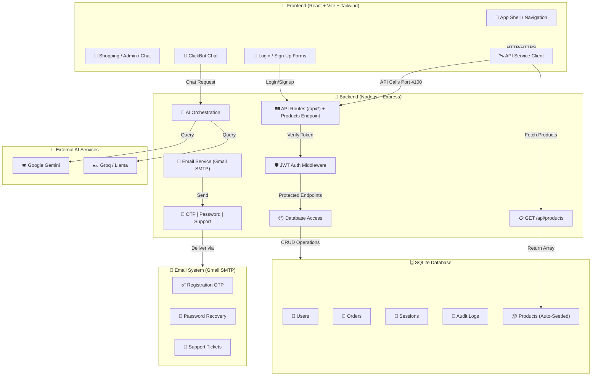
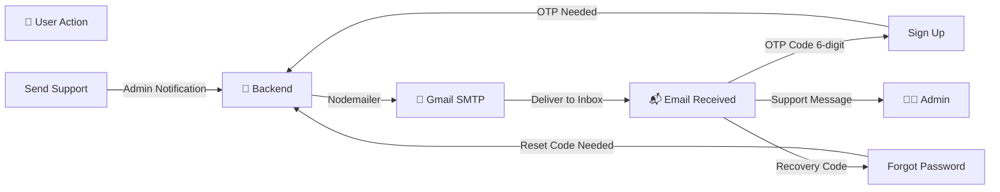
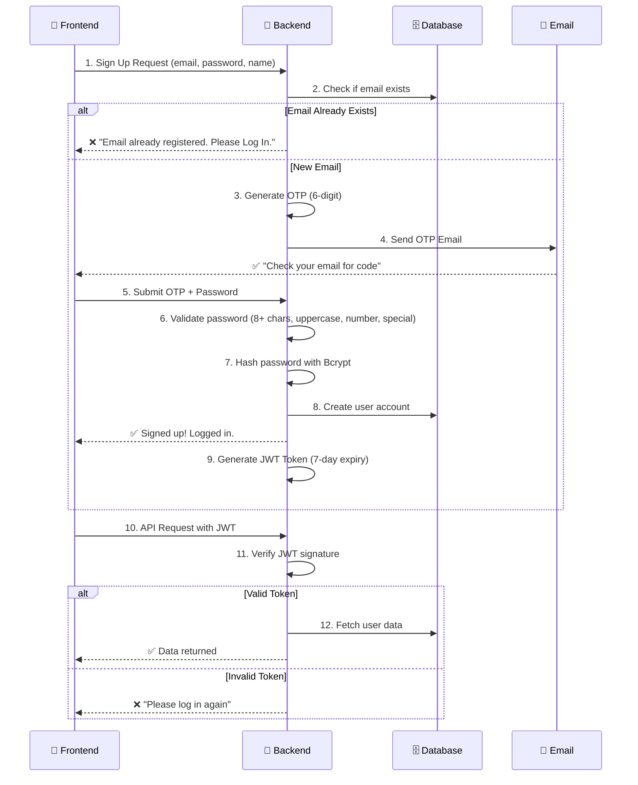

# 📐 ClickBazaar System Architecture

**ClickBazaar** is a full-stack e-commerce platform designed for security, scalability, and excellent user experience.

---

## 🏗️ System Overview

High-level architecture with all components:



---

## 📧 Email System Flow (3 Features)



---

## 🔐 Authentication & Security Flow



---

## 🔨 Backend API Routes

### **Authentication**  

- `POST /api/register/send-otp` - Send registration OTP email
- `POST /api/register` - Complete registration (requires OTP)
- `POST /api/login` - Authenticate user, return JWT
- `POST /api/logout` - Clear session
- `POST /api/forgot-password` - Send password reset OTP
- `POST /api/verify-otp` - Verify password reset code
- `POST /api/reset-password` - Set new password

### **User (Protected by JWT)**  

- `GET /api/me` - Get current user profile
- `PUT /api/profile` - Update profile info
- `GET /api/orders` - Get user orders
- `POST /api/orders` - Create new order

### **Admin Only (Requires JWT + Admin Role)**  

- `GET /api/admin/users` - List all users
- `GET /api/admin/orders` - List all orders
- `POST /api/admin/users/:id/role` - Change user role
- `POST /api/admin/orders/:id/status` - Update order status
- `GET /api/admin/audit` - View system audit logs
- `GET /api/admin/sessions` - View active sessions

### **Support**  

- `POST /api/support/inquiry` - Submit support ticket (sends email to admin)

### **AI Services**  

- `POST /api/chat` - Chat with ClickBot (uses Gemini/Groq)
- `POST /api/genai/description` - Generate product descriptions
- `POST /api/genai/recommendations` - Get product recommendations

---

## 🛡️ Security Implementation

| Feature | Technology | How It Works |
| --------- | ----------- | ------------- |
| **Password Storage** | Bcryptjs (10 rounds) | Passwords hashed before database storage |
| **Session Management** | JWT (7-day tokens) | Stateless auth, expires after 7 days |
| **Email Verification** | Gmail SMTP + OTP | 6-digit code (10-min expiry) for signup/password reset |
| **Role-Based Access** | Middleware checks | Users can only access their own data; admins can access all |
| **Admin Protection** | Secret admin key | Extra verification when setting admin role |
| **Security Headers** | Helmet.js | Protects against XSS, CSRF, clickjacking |
| **CORS** | Express CORS | Prevents unauthorized cross-origin requests |
| **Password Rules** | Regex validation | Enforced on signup: 8+ chars, uppercase, lowercase, number, special |
| **Duplicate Prevention** | Email validation | Can't signup twice with same email |
| **Audit Logging** | Database logs | All admin actions recorded with timestamp |

---

## 📦 Database Schema

**Users Table**  

```sql
- id (PRIMARY KEY)
- name (string)
- email (UNIQUE, LOWERCASE)
- password_hash (bcrypt hash)
- role (customer | admin)
- membership_tier (string)
- wishlist (JSON array)
- cart (JSON array)
- created_at (timestamp)
```

**Orders Table**  

```sql
- id (PRIMARY KEY)
- user_id (FOREIGN KEY)
- items (JSON array)
- total_price (decimal)
- status (pending | processing | shipped | delivered)
- created_at (timestamp)
- updated_at (timestamp)
```

**Sessions Table**  

```sql
- id (PRIMARY KEY)
- user_id (FOREIGN KEY)
- created_at (timestamp)
```

---

## 🔄 Data Flow Examples

### **User Registration**  

1. User fills signup form (name, email, password)
2. Frontend validates password strength
3. Backend checks if email exists (prevents duplicates)
4. Backend generates 6-digit OTP
5. Backend sends OTP via Gmail SMTP
6. User enters OTP in frontend
7. Backend validates OTP and password strength again
8. Backend hashes password with Bcrypt
9. Backend creates user record in database
10. Backend generates JWT token
11. Frontend stores token, user logged in

### **Making Authenticated Request**  

1. Frontend reads JWT from storage
2. Frontend includes JWT in `Authorization` header
3. Backend receives request
4. Backend middleware verifies JWT signature
5. Backend checks if token expired
6. If valid: Request processed, returns data
7. If invalid: Return 401 "Unauthorized"

### **Support Ticket Flow**  

1. User fills support form (name, email, message)
2. Frontend sends to `POST /api/support/inquiry`
3. Backend validates input
4. Backend calls `sendSupportInquiry()` function
5. Email service connects to Gmail SMTP
6. Email service composes HTML email
7. Email sent to admin email address
8. Backend returns success response to user
9. Admin receives support ticket in inbox

---

## ⚡ Performance Considerations

- **JWT Stateless**: No session database needed, scales horizontally
- **SQLite Local**: Fast for development; use PostgreSQL for production
- **Async Email**: Email sending doesn't block API response
- **Caching**: Frontend caches user data in React state
- **Compression**: Gzip enabled on Express responses

---

### 🔗 Quick Links

[🏠 Back to README](./README.md) | [📜 Instructions](./INSTRUCTIONS.md) | [🗺️ User Guide](./USER_GUIDE.md) | [⚖️ License](./LICENSE)

---

© 2026 ClickBazaar. Built with security and simplicity in mind.
